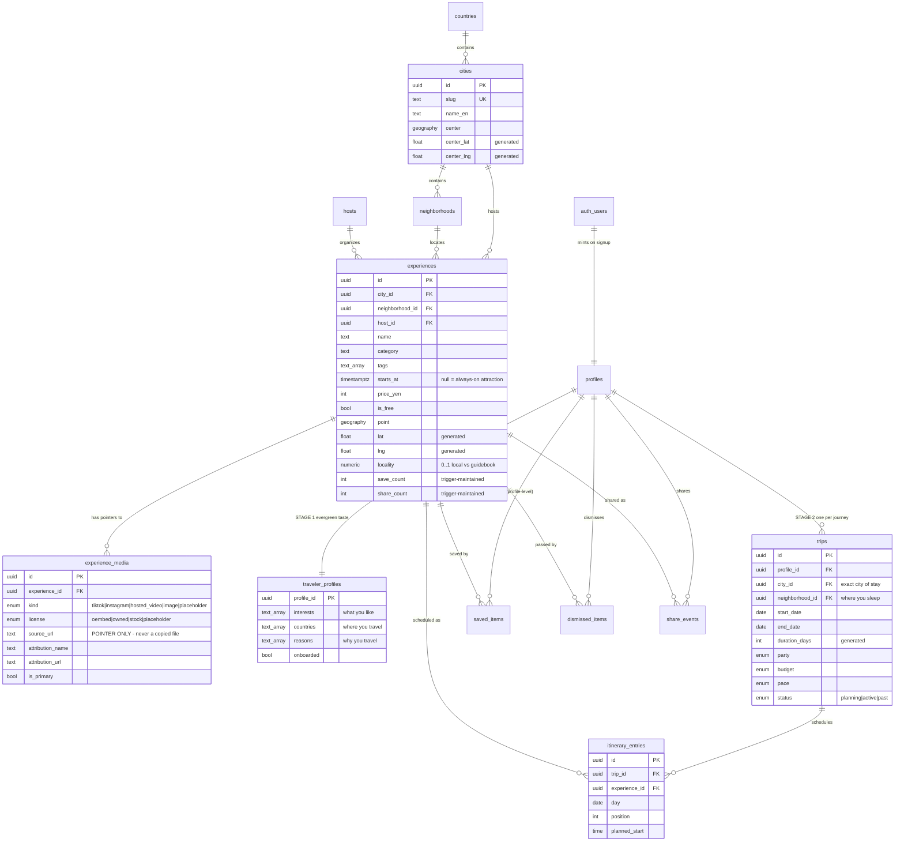

# Architecture

Backend and engine only. The UI is built by a separate team against the RPC
contract in [`api-contract.md`](./api-contract.md).

---

## 1. System architecture

There is **no application server** on the data path. The client calls Postgres
functions through PostgREST, and Postgres enforces every permission itself
through Row Level Security. That removes the tier which usually breaks under
time pressure, and RLS is the pattern this product would use in production
anyway — not a hackathon shortcut.

One route handler exists, on the side, and it is not on the data path: the AI
chat sheet, which needs somewhere to keep an Anthropic key that is not the
browser. It makes no authorization decision — it forwards the traveler's own
token and the same RLS answers.

```
╔════════════════════════════════════════════════════════════════════════════╗
║  CLIENT — built by the UI team (Next.js / Tailwind / shadcn)               ║
║                                                                            ║
║   Explore feed · Saved · Itinerary · Profile                               ║
║        │                                                                   ║
║        │  supabase-js  →  rpc('feed'), rpc('save_experience'), …           ║
║        │  anon JWT attached to every call                                  ║
║        │                                                                   ║
║        ├─ media rendered client-side:                                      ║
║        │    tiktok/instagram → official oEmbed endpoint (keyless, 2026)    ║
║        │    placeholder      → local asset, no network                     ║
║        │                                                                   ║
║        └─ chat sheet ─► POST /api/itinerary/chat  (traveler's JWT in hdr)  ║
╚═══════════════════════════════╤═══════════════════════════╤════════════════╝
                                │ HTTPS                     │
                                │        ╔══════════════════▼════════════════╗
                                │        ║  NEXT.JS ROUTE HANDLER            ║
                                │        ║   holds ANTHROPIC_API_KEY, and    ║
                                │        ║   nothing else. No service role.  ║
                                │        ║                                   ║
                                │        ║   Claude Sonnet 5 + 8 tools       ║
                                │        ║   get_plan · search_experiences   ║
                                │        ║   list_saved · add_stop           ║
                                │        ║   move_stop · remove_stop         ║
                                │        ║   rebuild_plan · check_conflicts  ║
                                │        ║                                   ║
                                │        ║   every tool = an RPC below,      ║
                                │        ║   called with the SAME JWT        ║
                                │        ╚══════════════════╤════════════════╝
                                │                           │
╔═══════════════════════════════▼═══════════════════════════▼════════════════╗
║  SUPABASE EDGE                                                             ║
║    GoTrue (anonymous sign-in)  ·  PostgREST (RPC)  ·  Storage (avatars)    ║
╚═══════════════════════════════╤════════════════════════════════════════════╝
                                │ SQL, as role `authenticated`
╔═══════════════════════════════▼════════════════════════════════════════════╗
║  POSTGRES + POSTGIS                                                        ║
║                                                                            ║
║  ── RLS ─────────────────────────────────────────────────────────────────  ║
║   catalogue (cities, experiences, media, hosts)   → public read            ║
║   personal  (taste, trips, saves, dismissals,     → owner only,            ║
║              itinerary)                             via current_profile_id ║
║                                                                            ║
║  ── FUNCTIONS = the entire API ──────────────────────────────────────────  ║
║   stage 1  onboarding_options · save_profile_onboarding                    ║
║            my_profile · update_profile                                     ║
║   stage 2  trip_options · create_trip · update_trip · delete_trip          ║
║            my_trips · trip_suggestions                                     ║
║   read     feed · explore · explore_sections · experience_detail           ║
║            my_saved · my_itinerary                                         ║
║   write    save/unsave_experience · dismiss_experience · undo_dismiss      ║
║            share_experience · add_to_itinerary                             ║
║            update_itinerary_entry · remove_from_itinerary                  ║
║   planner  build_itinerary · trip_days · itinerary_conflicts               ║
║                                                                            ║
║  ── VIEW ────────────────────────────────────────────────────────────────  ║
║   experience_cards   one card shape reused by every surface                ║
║                                                                            ║
║  ── TRIGGERS ────────────────────────────────────────────────────────────  ║
║   saved_items  → experiences.save_count      (denormalised social proof)   ║
║   share_events → experiences.share_count                                   ║
║   auth.users   → mint a profile on first sign-in                           ║
╚═══════════════════════════════▲════════════════════════════════════════════╝
                                │ service-role, offline, never during a demo
        ┌───────────────────────┴────────────────────────┐
        │                                                │
  ingest_places.py                              enrich_tavily.py
  Overpass / event sources → experiences        Tavily → blurbs, hidden gems
        │                                                │
        └──────────────► stay22_links.py ◄───────────────┘
                         accommodation affiliate URLs
```

**Why the ingestion lane is separate.** Everything that touches a third party
runs *before* the demo and writes to the database. Nothing in the request path
depends on Overpass, Tavily, or Stay22 being reachable while a judge is
watching.

**Why the chat sheet does not weaken any of that.** It is drawn as a side
branch on purpose. It cannot reach a table the RPC surface does not already
expose, it runs as the traveler rather than as the service role, and the trip
it may edit is fixed by the request before the model sees anything. If the
route is down, every other screen still works — the sheet is an alternative
input method for the itinerary, not a dependency of it.

---

## 2. Data model



### Four modelling decisions worth defending

**Taste and trips are separate tables.** `traveler_profiles` holds what a person
is into, forever. `trips` holds one journey. Conflating them — which the first
version did — means a traveler can only ever have one trip, editing dates
clobbers their interests, and the feed cannot work until they commit to
travelling. That last one is fatal for a product people scroll for inspiration
long before they book.

**Saves are profile-level, not trip-level.** Someone saves a Kyoto workshop
eighteen months out, and `trip_suggestions()` hands it back when they finally
plan Kyoto. That bridge is the payoff of keeping the two apart.

**Events and attractions are one table.** The difference between "Tenjin Matsuri
on the 24th" and "teamLab, open daily" is whether `starts_at` is null — not what
kind of row it is. One table means the feed, the scoring, the itinerary, and
search each have one code path instead of two that drift apart.

**Media rows are pointers, not files.** `experience_media` stores a canonical
post URL plus attribution. There is deliberately no column for video bytes or a
rehosted path. Embeds resolve client-side through the official TikTok and
Instagram oEmbed endpoints, both keyless as of 2026. Scraping and rehosting
would be a copyright and ToS problem, so the schema makes the wrong thing
impossible rather than merely discouraged.

**Dismissals are stored, not discarded.** A swipe-left is the strongest signal
the traveler produces. Keeping the row lets the engine down-weight the whole
category, not just hide one card.

---

## 3. Signup workflow, end to end

Signup asks **broad questions only**. Where do you travel, why do you travel,
what are you into. It does not ask for a city, dates, or a budget — those are
trip questions, and asking them at signup would force someone to have a trip
planned before they are allowed to look at anything.

There is **no password and no email**. Anonymous auth means the traveler is
scrolling within seconds of opening the app, and the account can be upgraded to
a real one later without losing a single save.

```
┌──────────────┐
│  App opens   │
└──────┬───────┘
       ▼
  session in
  localStorage? ──── yes ──►┌────────────────────┐
       │                    │ my_profile()       │
       no                   └─────────┬──────────┘
       │                              │
       ▼                        onboarded?
┌──────────────────────┐         │        │
│ signInAnonymously()  │        yes      no
└──────────┬───────────┘         │        │
           │                     ▼        └──────────┐
           ▼               ┌──────────┐              │
   ┌───────────────────┐   │   FEED   │              │
   │ TRIGGER (Postgres)│   └──────────┘              │
   │  on auth.users    │                             │
   │  ├ INSERT profiles│                             │
   │  └ INSERT         │◄────────────────────────────┘
   │    traveler_      │
   │    profiles (empty)│   nothing to configure — the row
   └─────────┬─────────┘    already exists, onboarding UPDATEs it
             │
             ▼
   ┌─────────────────────┐
   │ onboarding_options()│  ONE call returns everything the
   └─────────┬───────────┘  three screens need to render
             │
   ┌─────────┴───────────────────────────────────────────┐
   │                  STAGE 1 — three questions          │
   │                                                     │
   │  ① Where do you travel?     countries[]             │
   │     🇯🇵 Japan ✓  🇰🇷 Korea  🇹🇭 Thailand  🇮🇹 Italy    │
   │     (`available` flags where we actually have data) │
   │                                                     │
   │  ② Why do you travel?       reasons[]               │
   │     🍜 Eating my way around   ⛩ Culture             │
   │     🥾 Adventure   🌃 Going out   ♨️ Rest and reset  │
   │                                                     │
   │  ③ What are you into?       interests[]             │
   │     🍜 Restaurants  🌃 Bars & clubs  🥾 Hiking       │
   │     🏖 Beaches  🎨 Art  🎮 Anime  🎧 Music  …        │
   └─────────┬───────────────────────────────────────────┘
             ▼
   ┌──────────────────────────┐
   │ save_profile_onboarding( │   UPSERT traveler_profiles
   │   interests, countries,  │   onboarded = true
   │   reasons )              │
   └─────────┬────────────────┘
             ▼
   ┌───────────────────────────────────────────┐
   │  INSPIRATION FEED — no trip required      │
   │                                           │
   │  feed() scores on interests + reasons +   │
   │  countries. Nothing is penalised for      │
   │  being in the "wrong" city or over budget │
   │  because the traveler hasn't said where   │
   │  they're going or what they'll spend.     │
   │                                           │
   │  swipe right → saved_items (PROFILE-level)│
   │  swipe left  → dismissed_items            │
   └─────────┬─────────────────────────────────┘
             │
             │   …days, weeks, or months later…
             ▼
   ┌─────────────────────────────────────┐
   │  traveler taps "Create itinerary"   │
   │  — or taps "Add to itinerary" and   │
   │    the engine raises `no trip yet`  │
   └─────────┬───────────────────────────┘
             ▼
   ┌─────────────────────┐
   │ trip_options('JP')  │  cities + neighbourhoods + counts
   └─────────┬───────────┘
             │
   ┌─────────┴───────────────────────────────────────────┐
   │              STAGE 2 — the deeper questions          │
   │                                                     │
   │  Exact city of stay        Osaka                    │
   │  Neighbourhood staying in  Tenma                    │
   │  When / how long           14 Sep, 4 nights         │
   │  Who with                  Group                    │
   │  Budget                    Shoestring               │
   │  Pace                      Packed                   │
   └─────────┬───────────────────────────────────────────┘
             ▼
   ┌──────────────────┐
   │  create_trip(…)  │  INSERT trips (status 'planning')
   └─────────┬────────┘
             ▼
   ┌────────────────────────────────────────────────────┐
   │  PLANNING FEED — same person, same taste,          │
   │  trip context now applied                          │
   │                                                    │
   │  city match      +2.5   wrong city  −3.5           │
   │  staying-here    +1.0                              │
   │  within dates    +2.5   outside     −2.0           │
   │  budget fit      +1.5   overshoot   scaled penalty │
   │                                                    │
   │  "In Tenma, where you are staying"                 │
   └─────────┬──────────────────────────────────────────┘
             ▼
   ┌──────────────────────────────────────────────┐
   │ trip_suggestions()                           │
   │ "You saved these in Osaka — add them?"       │
   │ ← the payoff of profile-level saves          │
   └─────────┬────────────────────────────────────┘
             ▼
        add_to_itinerary() → itinerary_entries (trip-scoped)
```

### Why it is shaped this way

**Anonymous first.** No email, no password, no verification step. A traveler is
scrolling in seconds, which matters enormously for a product whose whole premise
is casual discovery. The session persists in the browser, so a refresh
re-attaches to the same profile — state lives in Postgres, not `localStorage`.

**The empty taste row is created by the trigger, not by onboarding.** So there
is no "does the row exist yet" branch anywhere in the client; onboarding is
always an update.

**Stage 2 is reachable from two directions.** Either the traveler taps "create
itinerary" deliberately, or they tap "add to itinerary" on a card and
`add_to_itinerary` raises `no trip yet`. That error is not a failure to hide —
it is the designed cue to open the trip questions at the exact moment they
became relevant.

**Onboarding can be skipped.** `feed()` works with an empty taste profile: it
falls back to locality and social proof, so the app is never a blank screen.

---

## 4. End-to-end dataflow — the demo journey

```
TRAVELER                CLIENT                    POSTGRES
   │                      │                          │
   │  opens app           │                          │
   ├─────────────────────►│  signInAnonymously()     │
   │                      ├─────────────────────────►│  trigger on auth.users
   │                      │                          │  └─► INSERT profiles
   │                      │                          │
   │                      │  rpc onboarding_options()│
   │                      ├─────────────────────────►│  interests + cities +
   │                      │◄─────────────────────────┤  neighborhoods, 1 doc
   │  picks interests,    │                          │
   │  dates, budget,      │  rpc save_onboarding(…)  │
   │  cities, style       ├─────────────────────────►│  UPSERT traveler_prefs
   ├─────────────────────►│                          │
   │                      │                          │
   │                      │  rpc feed(limit 20)      │
   │                      ├─────────────────────────►│  experience_scores()
   │                      │                          │    ├ interest overlap
   │                      │                          │    ├ destination match
   │                      │                          │    ├ trip-date fit
   │                      │                          │    ├ budget fit
   │                      │                          │    ├ style fit
   │                      │                          │    ├ save/dismiss affinity
   │                      │                          │    ├ locality bonus
   │                      │                          │    └ social proof (damped)
   │                      │◄─────────────────────────┤  cards + score + reasons[]
   │  sees cards with     │                          │
   │  "Because you like   │  (media: oEmbed resolved │
   │   street food"       │   client-side, or        │
   │                      │   placeholder)           │
   │                      │                          │
   │  swipe LEFT          │  rpc dismiss_experience  │
   ├─────────────────────►├─────────────────────────►│  INSERT dismissed_items
   │                      │                          │  └─► category down-weighted
   │                      │                          │      on the NEXT feed call
   │  swipe RIGHT         │  rpc save_experience     │
   ├─────────────────────►├─────────────────────────►│  INSERT saved_items
   │                      │                          │  ├─► trigger: save_count++
   │                      │                          │  └─► clears any dismissal
   │                      │                          │
   │  taps a card         │  rpc experience_detail   │
   ├─────────────────────►├─────────────────────────►│  ONE call returns:
   │                      │◄─────────────────────────┤  card + all media + host
   │                      │                          │  + reasons + 6 related
   │                      │                          │
   │  "Add to itinerary"  │  rpc add_to_itinerary    │
   ├─────────────────────►├─────────────────────────►│  INSERT itinerary_entries
   │                      │                          │  ├─ day defaults: event date
   │                      │                          │  │  → trip_start → today
   │                      │                          │  ├─► also saves it
   │                      │                          │  └─► clears any dismissal
   │                      │                          │
   │  opens Itinerary tab │  rpc my_itinerary()      │
   │                      ├─────────────────────────►│  grouped by day,
   │                      │◄─────────────────────────┤  ordered by position,
   │  sees a timeline     │                          │  with per-day yen total
   │                      │                          │
   │  refreshes the page  │  session persists →      │  state is in Postgres,
   ├─────────────────────►│  same profile, same data │  not localStorage
```

**Why refresh survives.** Demo state lives in Postgres keyed to the anonymous
auth user, and the Supabase session persists in the browser. A page refresh
re-attaches to the same profile rather than resetting the demo — which is one
of the explicit conditions in the definition of done.

---

## 5. How one card gets its score and its explanation

The scoring pass emits the number **and** the sentence together, in the same
expression. They cannot drift apart, so the "why" a judge reads is literally the
reason the card ranked where it did — not a second guess about it.

```
                    traveler_preferences        experiences
                    interests, destinations,    category, tags, city,
                    trip dates, budget, style   starts_at, price, locality
                              │                        │
                              └───────────┬────────────┘
                                          ▼
                              ┌───────────────────────┐
    saved_items / ───────────►│  experience_scores()  │
    dismissed_items           │                       │
    (category affinity)       │  dismissed → EXCLUDED │
                              └───────────┬───────────┘
                                          │
              ┌───────────────────────────┼──────────────────────────┐
              ▼                                                      ▼
      score  numeric                                        reasons  text[]
      ───────────────                                       ─────────────────
      interest overlap      +3.0        ──────────────►  "Because you like street food"
      destination match     +2.5 / −3.5 ──────────────►  "In Osaka"
      neighborhood match    +1.0        ──────────────►  "In Shibuya, where you're staying"
      in trip window        +2.5        ──────────────►  "Happening during your Osaka dates"
      always-on attraction  +0.8
      budget fit            +1.5 / scaled penalty
      travel style          +1.0        ──────────────►  "Good for group travel"
      saved this category   +0.5 each (cap 1.5)  ─────►  "You have saved food before"
      dismissed category    −0.75 each (cap 2.0)
      locality              +1.2 × locality  ─────────►  "Locally hosted, not on the
                                                          tourist trail"
      happening ≤ 7 days    +0.8        ──────────────►  "Happening this week"
      social proof          +ln(saves) × 0.25, capped at 1.0
```

**Two deliberate choices in that table.** A wrong destination is *penalised*,
not merely unrewarded — someone who said they are going to Kyoto should not see
Tokyo at the top however well it matches on taste. And the budget penalty scales
with how badly the price overshoots, because a flat penalty let a ¥14,000
kaiseki outrank free things for a shoestring traveler.

Social proof is deliberately damped and capped. Popularity should nudge the
ordering, never dominate it, or the feed collapses to the same handful of cards
for every traveler — which is the exact failure the product exists to avoid.

---

## 6. Sponsor integrations

All three run **offline, before the demo**, and write to the database. Nothing
in the request path can be broken by a third party being slow or down.

| Sponsor | Role | Where it lands |
|---|---|---|
| **Stay22** | Direct Travel API — live accommodation from Booking, Expedia, Hotels.com, VRBO | `experiences.stay22_url`, surfaced on detail + itinerary |
| **Tavily** | Build-time enrichment: blurbs, "known for", hidden-gem signals, and finding genuinely embeddable public posts | `experiences.description`, `locality`, `experience_media` |
| **AeroXplorer** | Arrival context — flight status feeding a "you just landed" first-day route | Optional; not on the core path |
```
